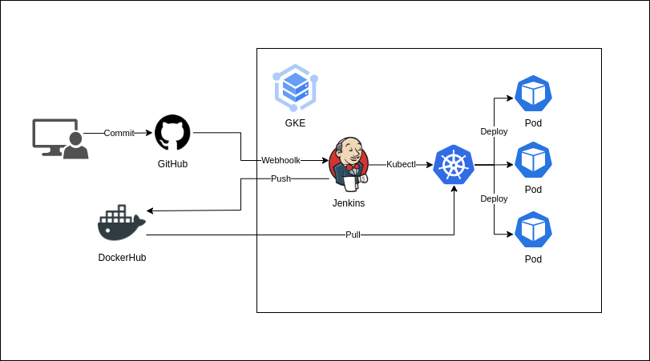
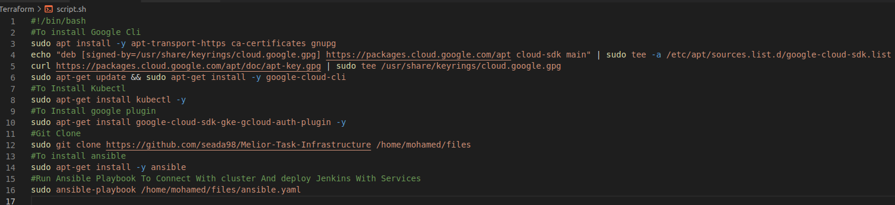
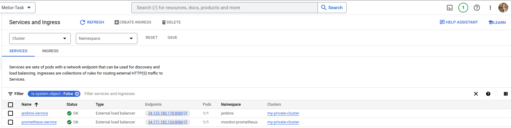
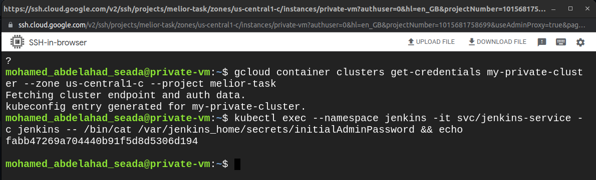

# Melior-Task-Infrastructure



## Task Overview:

Setting up a CI/CD pipeline for a Django web application using Jenkins . The application includes a Django backend, a PostgreSQL database, and a React frontend. By Using Terraform to create infrastructure GCP. The goal is to automate the build test, and deployment processes to ensure efficient and reliable software delivery 

## Build the Infrastructure

### 1. Clone The Repo:
```
git clone https://github.com/seada98/Melior-Task-Infrastructure
```
### 2. Navigate to the Terraform Code
> After you clone the code you need to navigate to the `terraform` folder to build the infrastructure:
```
cd Terraform/
```
#### 3. Config Credentials 
* Move Your Credential file to terraform directory and replace it in ( provider.tf )
* Change name of the project with you project ID
```
provider "google" {
  project     = "YOUR-PROJECT-ID"
  region      = "us-central1"
  credentials = file("YOUR-CREDENTIAL")
}
```
#### 4. Initialize Terraform
```
terraform init
```

#### 5. Check Plan
```
terraform plan
```

#### 6. Apply the plan *it will take some time to complete*
```
terraform apply
```

## Script When The Build Finish Will Startup Automatically Start VM 



### The Script Will Do:

  * Install gcloud 
  * Install kubectl
  * Install gcloud plugin
  * Git Clone the repo
  * Install Ansible
  * Apply Ansible yaml File

### Ansible yaml Will Do:

  * Connect to cluster
  * Create Jenkins namespace
  * Deploying jenkins & loadbalancer servies
  * Create Prometheus namespace
  * Deploying Prometheus & loadbalancer servies

## Check Services To Get URL For Jenkins and Prometheus , Connect To VM 

### For Jenkins
```
kubectl get svc -n jenkins
```
### For Prometheus
```
kubectl get svc -n monitor-prometheus
```
### or you can get it from google console



### To Get Jenkins Password Connect To VM And Type
```
kubectl exec --namespace jenkins -it svc/jenkins-service -c jenkins -- /bin/cat /var/jenkins_home/secrets/initialAdminPassword && echo
```


### Install Plugin And Create Your Admin User In Jenkins

## Now you are ready to use Jenkins and Prometheus on a GKE cluster! 

### Connected Repository:

CI/CD using Jenkins --> https://github.com/seada98/Melior-Task-App